# Présentation de notre projet ***'Multicast'***

## <u>Introduction :</u>
### Notre site **"Multicast"** est une plateforme d'hébergement de serveurs en ligne. Il loue contre une rémunération, différents types de serveurs qui seraient adaptés au besoin du client. Cela comprend les serveurs de stockage, de jeu et web.

 

## <u>**Présentation des fonctionnalités (Comptes) :**</u>

 

## **L'inscription :**
### Chaque visiteur du site a la possibilité de se créer un compte via un formulaire créer pour l'occasion.

 

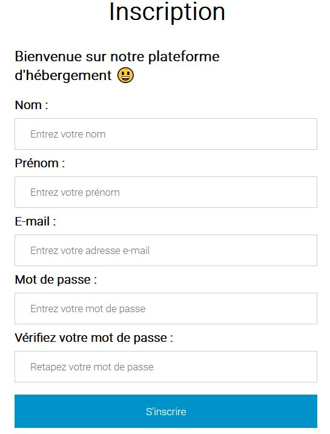

## *~ En back-end ~*
### Une requête SQL va automatiquement se faire en PHP pour insérer le nouvel utilisateur dans la base de données. Le mot de passe est automatiquement hashé en SHA-1 pour la sécurité. 

 

## **La connexion :** 
### Une fois le compte créé, l'utilisateur peut naturellement se connecter sur le site via la page dédiée.
 

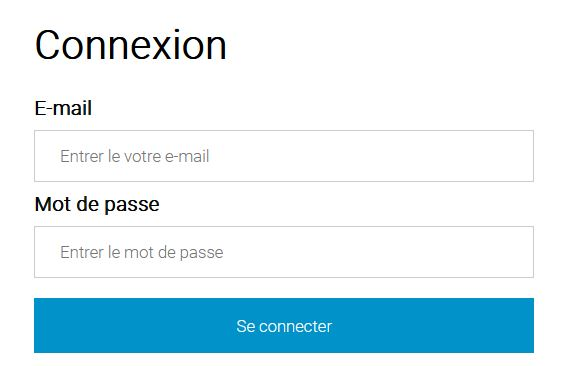

## *~ En back-end ~*
### Une requête SQL va automatiquement se faire en PHP pour vérifier les données par rapport à la base de données. Le formulaire prend en compte les erreurs et les retournes pour guider l'utilisateur (Mauvais e-mail... ainsi de suite) 

 

## **Modification des informations de compte :**
### Si l'utilisateur souhaite modifier des informations de son compte comme son adresse mail, son mot de passe ou encore son pseudo, il peut le faire via une rubrique de gestion de compte.

 

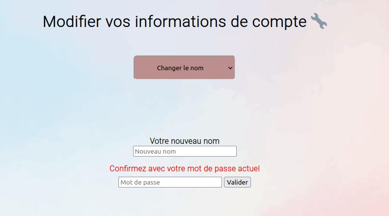

## *~ En back-end ~*
### Cela modifie automatiquement les données associées à chaque utilisateur. Les saisies sont filtrées pour éviter diverses injections SQL et ainsi les failles de sécurité. 

 

### Remarques : Tout ce qui est supprimé, que ce soit les utilisateurs, les serveurs... restent dans la base de données avec une valeur nulle à l'élément 'Actif' pour pouvoir garder un historique de chaque action et une certaine harmonie de la base de données.

 

------

 

## <u>**Présentation des fonctionnalités (Location) :**</u>

 

## **La location de serveur :** 
### Il est possible au visiteur une fois inscrit, d'accéder à un espace de location où il peut chercher en temps réel, par rapport à la disponibilité des serveurs et à ses besoins, la liste des serveurs louables en fonction de leurs caractéristiques.

 

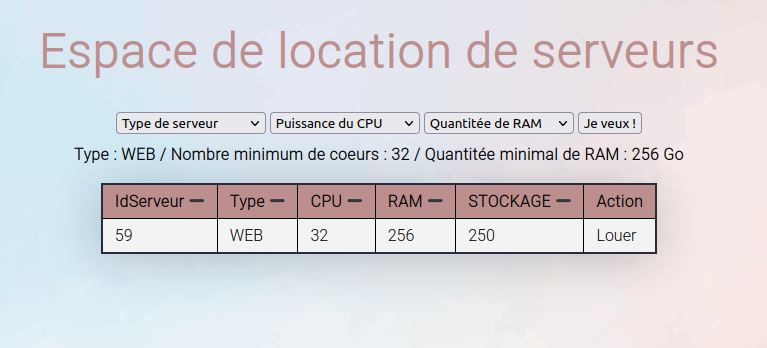

 

### Il peut alors choisir le serveur qui lui plait, puis d'un clic, le louer. Il lui sera alors attribué et ne pourra plus être loué par d'autres personnes. 

 

## *~ En back-end ~*
### Lorsque l'utilisateur clique sur le bouton "Louer", le serveur choisi est automatiquement relié à l'utilisateur via un IDutilisateur. C'est comme ça qu'il se démarque des autres serveurs libres (avec un IDutilisateur nul). 

 

## **La gestion des serveurs loués :**
### Une fois que l'utilisateur a louer ses différents serveurs, il a accès à une nouvelle page où il peut voir le récapitulatif des différents serveurs qu'il a pris, également la date de location, les spécificités mais également les rendre (ce qui rendra à nouveau possible la possibilité de louer ce dit serveur).

 

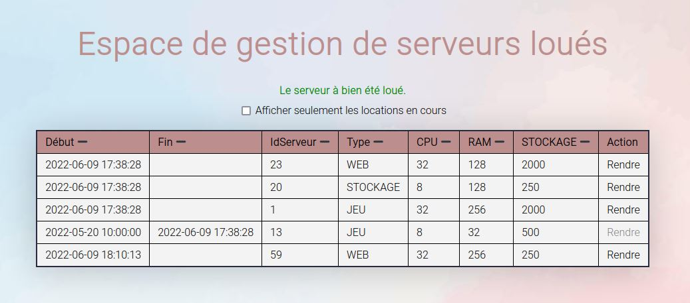

 

### Il est possible de trier par ordre dé/croissant chaque options ainsi que d'activer la fonction qui permet d'afficher uniquement les locations en cours. Les autres serveurs sont présents comme d'un historique de ses anciennes transactions.

 

## *~ En back-end ~*
### Une requête SQL va automatiquement se faire en fonction de l'ID de l'utilisateur connecté en regardant son ID de connexion. Il est donc possible d'afficher toutes les informations reliées au compte, notamment via son IDutilisateur qui lié à chaque serveur qu'il a loué. Le bouton 'Rendre' sert à remettre à zéro l'IDutilisateur lié au serveur.

-----

 

## <u>**Présentation des fonctionnalités d'administration :**</u>

 

## **La gestion des serveurs loués :**
### Lorsqu'on se connecte avec un compte spécialement prévu pour l'administration (admin en l'occurrence), la page débloque un nouvel onglet accessible uniquement pour cet utilisateur et qui lui permet de gérer toutes les informations lié aux serveurs ainsi que les utilisateurs.

 

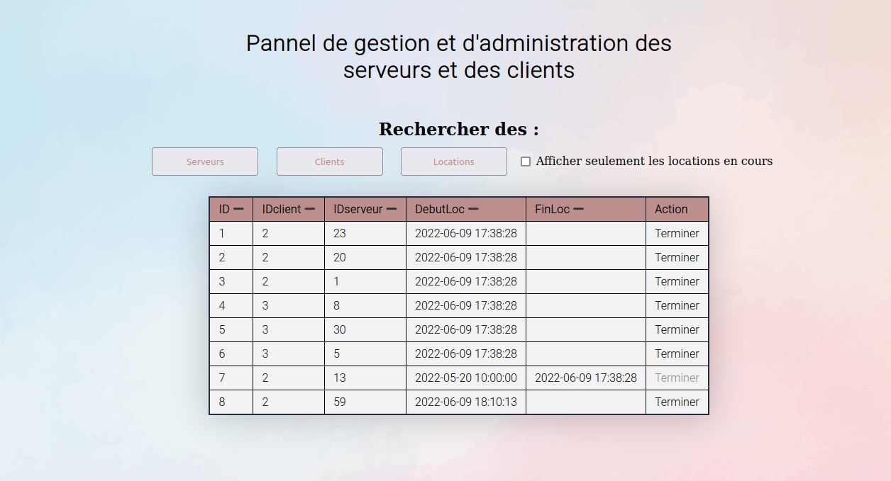

 

### **L'administrateur peut gérer sur cette page :**
 

* ### ~ Les serveurs : Cela implique d'afficher l'entièreté des serveurs disponibles ou non (Il y a également un historique des serveurs supprimés) mais également la présence d'un bouton 'Supprimer' qui sert à retirer de la base de donnée (Tout en gardant une trace) un serveur pour qu'il ne soit plus disponible à la location.
 

<u>Aperçu :</u> 
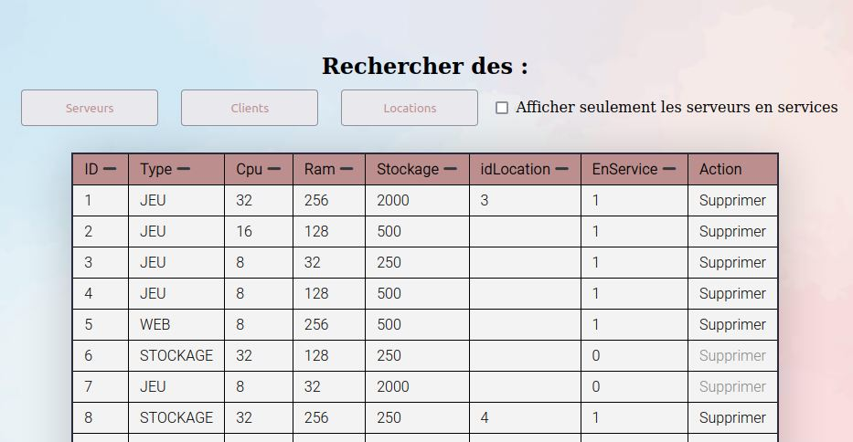

 

* ### ~ Les clients : Cet onglet affiche tous les utilisateurs inscrits sur le site ainsi que leurs informations principales comme leur adresse e-mail, leur ID, nom/prénom, mais il y a également un bouton 'Supprimer' qui sert simplement à retirer un utilisateur de la base de données pour qu'il ne puisse plus se connecter. Cela a pour effet de remettre à zéro tous les serveurs auquel il était lié.
 

<u>Aperçu :</u> 
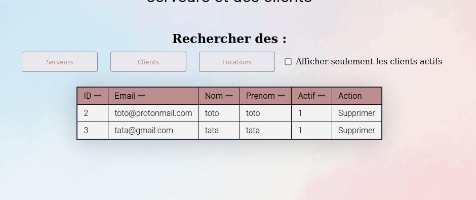

 

* ### ~ Les locations : Finalement dans cette section se trouve tous les serveurs qui sont ou ont étés loués. C'est pratique pour avoir une vue d'ensemble de l'activité des serveurs. Il y a un bouton 'Terminer' qui permet lui d'arrêter la location d'un serveur.

<u>Aperçu :</u> 
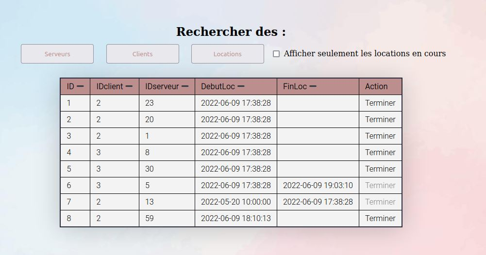

 

-----

 

## <u>**Présentation des facilités de développement:**</u>

 

## **Le même environnement pour tous**
### Afin de faciliter le processus de développement nous avons mis en place une infrastructure avec des conteneurs gérés sous docker. Tout les services ont la mêmes versions que sur le serveur r207.borelly.net .

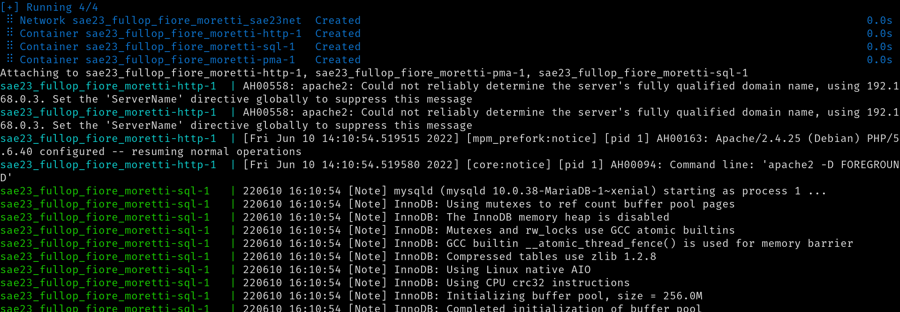
 

 

## **Une facilité de déploiement**
### Le site peut aussi êtres déployé plus facilement grâce au fichier docker-compose.yaml.

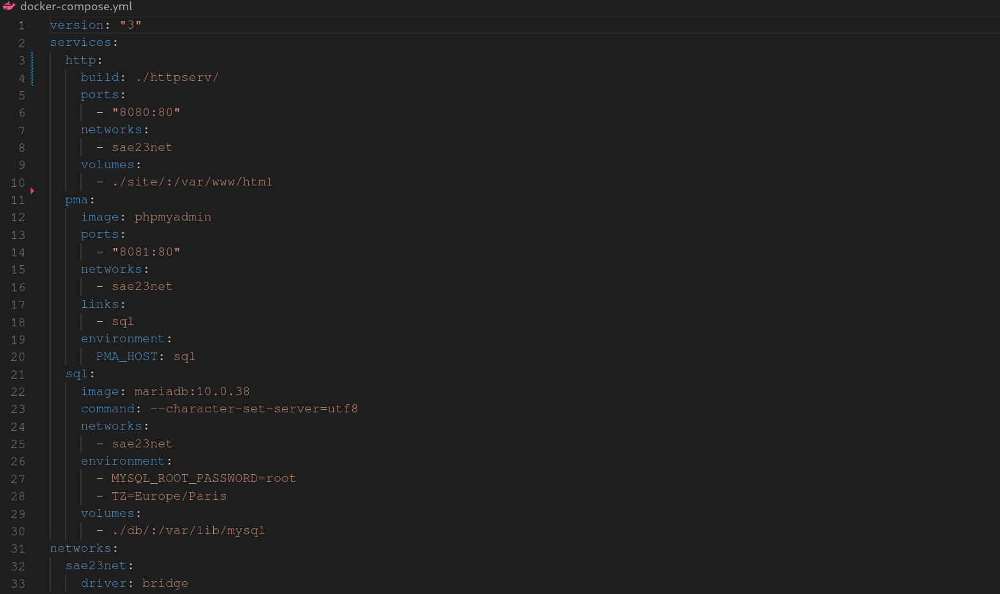
 

 

## **Une base de donnée configurable rapidement**
### Le script FillDb.py permet de générer des requpêtes SQL afin de remplir la base de fausses données, les fichier user.sql et db.sql permettent de mettre en place le squelette de la base de donnée.

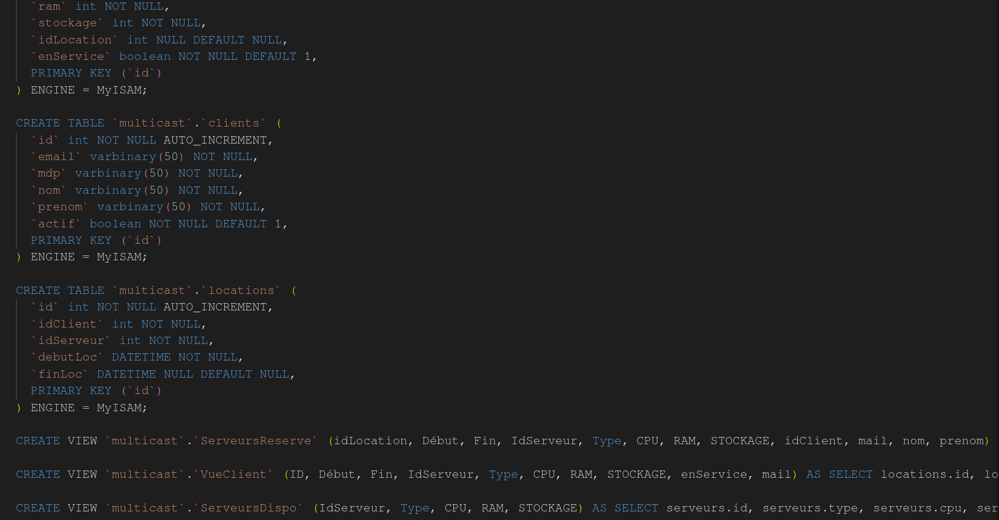
 

 

----
#### ☁️ Projet Multicast ~ Elouan FIORE, Timothée FULOP, Luigi MORETTI ☁️
  
 </body>
