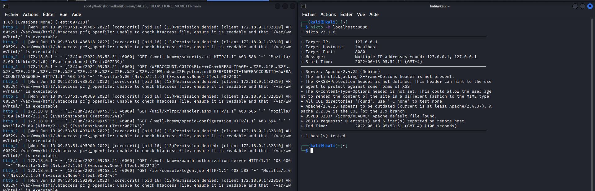
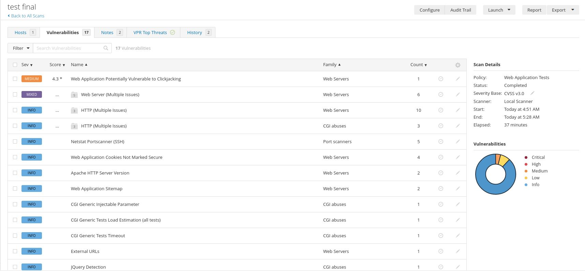
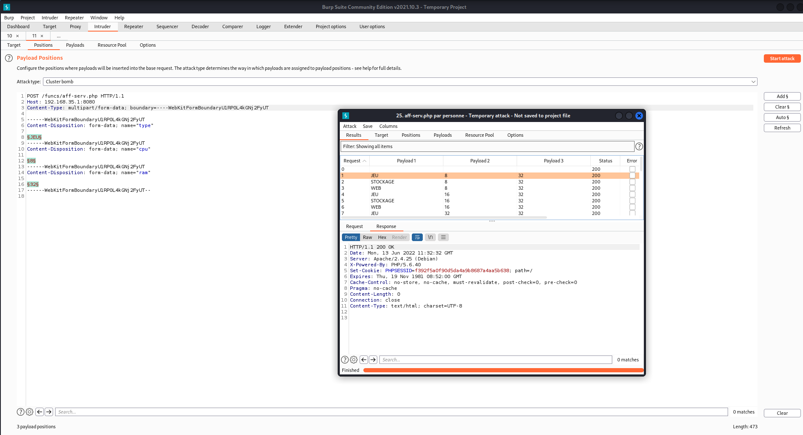
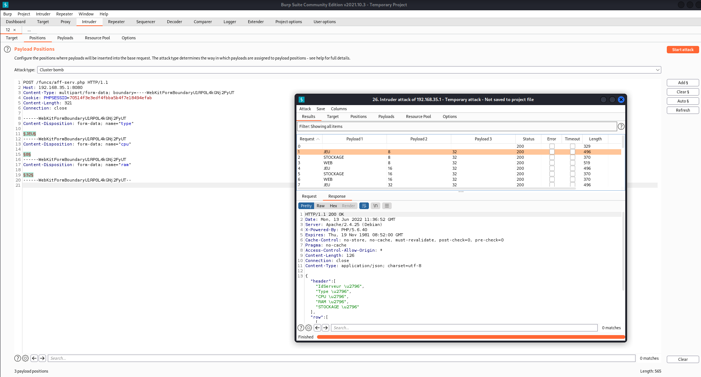
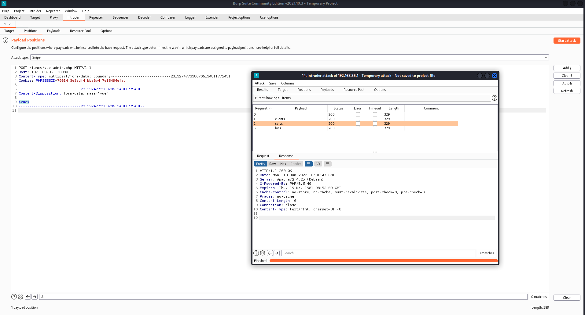
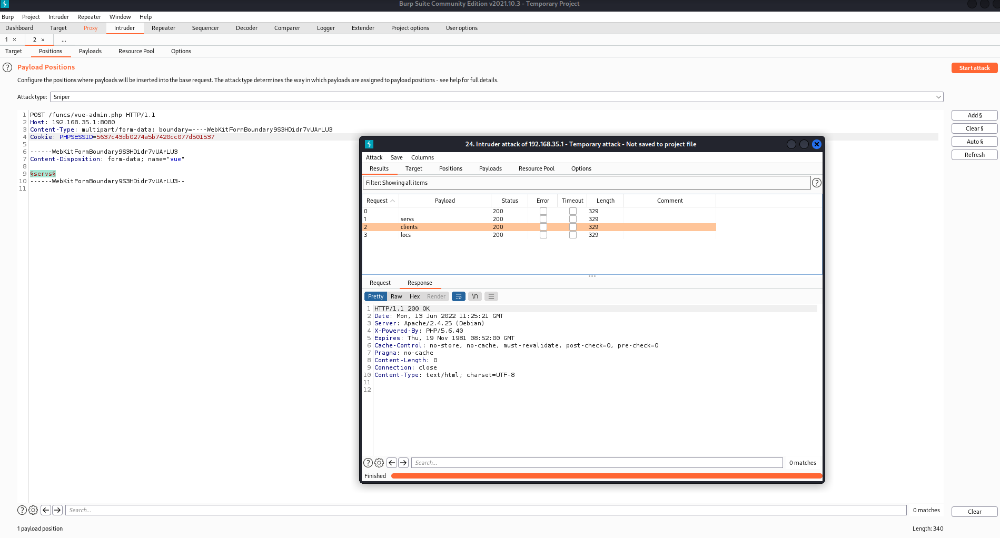
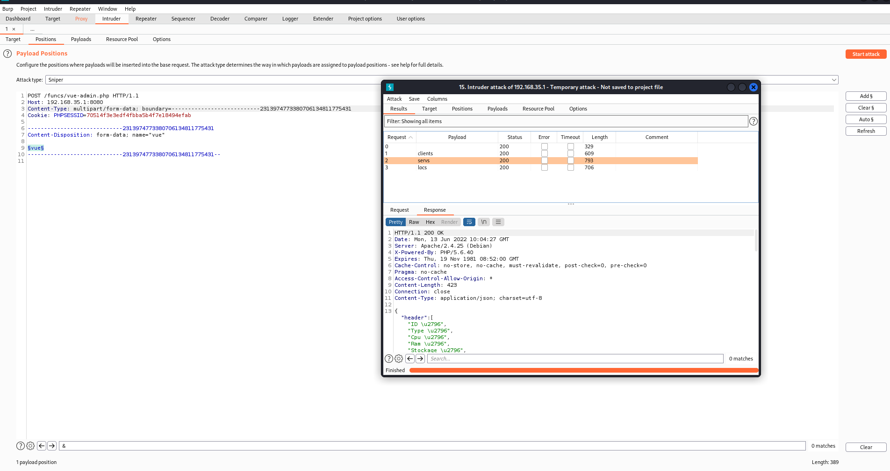

# Tests et mesures de sécurité de l'application web ***'Multicast'***

---

 

## <u>Scanners automatiques :</u>
### Pour chercher les failles les plus récurrentes et rapidement et surtout pour nous donner un plan d'ensemble des vulnérabilités présentes sur notre site, nous avons utilisé des outils de scans automatiques.

 

## **Nikto :** 
*Nikto est un scanner de vulnérabilité en ligne de commande logiciel gratuit qui analyse les serveurs Web à la recherche de fichiers/CGI dangereux, de logiciels serveur obsolètes et d'autres problèmes. Il effectue des vérifications génériques et spécifiques au type de serveur.*

 

### Commande lancé :
    nikto -h localhost:8080

 

 

## Retour du test : 
 

* ### Version de Apache pas mise à jour (2.4.25 au lieu de 2.2.34) ~ Cependant, pas de failles majeures sur cette version-ci.
   

* ### Pas de présence de protection anti-clickjacking dans le header du serveur apache :
### ~ Résolution du problème dans le fichier de configuration /etc/apache2/conf-enabled/security.conf sur apache :  

    a2enmod headers # Ajout d'un module

    sudo nano 000-default.conf # Modification configuration 

    Header set X-Frame-Options "DENY"
    Header set Content-Security-Policy "frame-ancestors 'none'"

 

## **Nessus :** 
*Nessus est un outil de sécurité informatique. Il signale les faiblesses potentielles ou avérées sur les machines testées. Ceci inclut, entre autres : les services vulnérables à des attaques permettant la prise de contrôle de la machine, l'accès à des informations sensibles, des dénis de service...*

 

### Test effectué : **Web Application Test**

 

 

## <u>Retour du test : </u>
 

* ### Application vulnérable au Clickjacking -> Cependant résolu après retour du test précédent
* ### Aucunes failles majeures ou hautes sur le site détecté
* ### Transmission des informations en clair (expliqué par le fait qu’on n’utilise pas d'https)

 

## <u> Résumé des tests : </u>

 

* ### Aucune faille majeure n'a été détecté parmi les deux tests automatiques.
* ### Une faille moyenne a été résolue.

---

 

## <u>Tests manuels (Burpsuite / Injections Sql) :</u> 

 

### Parce-que les scanners automatiques ne sont pas toujours fiables, nous avons tester certaines actions que ne devraient normalement pas êtres autorisés pour un utilisateur lambda ou sans compte.

 

## <u>**Tests sur la fonction 'Aff-serv.php' :**</u>
*Cette fonction retourne un tableau JSON selon ce qu'à demander l'utilisateur (TYPE,RAM,CPU). **Cette fonction est utilisée sur la page 'Location' et doit être accessible seulement aux utilisateurs connectés***

 

### **Premier test en tant qu'utilisateur non connecté :**
 

 

### On remarque qu'il n'y a aucune réponse en body, ce qui veut dire que sans cookie de connexion, la page ne nous retourne rien.

 

### **Deuxième test en tant qu'utilisateur connecté :**
 

 

### Avec le cookie de connexion d'un utilisateur lambda, nous avons bien en retour une réponse (en vert en partie), ce que nous n’avions pas auparavant. La fonction fonctionne donc bien seulement avec un utilisateur connecté.

 

## **Test passé avec succès !** 

 

## <u>**Tests sur la fonction 'vue-admin.php' :**</u>
*Cette fonction retourne des données json qui constituent la page pannel d'administration destiné à l'administration des serveurs. **Cette fonction est utilisée sur la page 'gestion' et doit être accessible seulement à l'utilisateur admin.***

 

### **Premier test en tant qu'utilisateur non connecté :**
 

 

### On remarque qu'il n'y a aucune réponse en body, ce qui veut dire que sans cookie de connexion, la page ne nous retourne rien comme prévu.

 

### **Deuxième test en tant qu'utilisateur connecté :**
 

 

### Avec le cookie de connexion d'un utilisateur lambda, nous avons bien également zéro retour de la part de la fonction.

 

### **Troisième test en tant qu'utilisateur admin :**
 

 

### Avec le cookie de connexion de l'administrateur du site, nous avons bien des données reçues de la part de la fonction réservé à l'admin. Nos données sont donc bien sécurisées face aux requêtes malveillantes !

## **Test passé avec succès !** 

 

---
 

## <u>**Au niveau des injections SQL / XSS :**</u> 

 

### Nous avons sécurisé nos entrées utilisateurs grâce à des fonctions php. Chaque entrée est 'sanitized' grâce aux fonction HTMLSpecialChars contre les failles XSS ainsi que pdo.prepare contre les injections SQL.

 

### Cependant, si la fonction PDO prepare n'était pas possible à intégrer, on vérifie l'entrée utilisateur en faisant attention qu'elle rentre bien dans un dictionnaire que nous avons prédéfini à l'avance pour ne pas qu'il puisse mettre ce qu'il veut à la place.

