<body style="background-color:black;">

# Tutoriel d'installation et d'utilisation de ***'Multicast'***

<p style="text-align:center;"></p>

---

## <u>Les téléchargements nécessaires :</u> 
<br>

### Comme expliqué dans le cahier des charges, le site web ainsi que sa base de données fonctionne sous Docker 🐋, qui permet de conteneuriser des processus sur une machine.
### Il vous faudra donc naturellement le télécharger sur votre machine pour que tout puisse fonctionner. Pour cela veuillez-vous référez à la page officielle du projet, où vous trouverez toutes les étapes d'installation en fonction de votre système d'exploitation : https://www.docker.com/get-started/

<p style="text-align:center;"></p>

<br>

### Finalement, il faudra cloner le repository où vous trouverez toutes les ressources que ce soit pour le site ou la base de données. Il peut se faire en téléchargeant directement depuis Github ou via un terminal avec la commande suivante :

    git clone https://github.com/ElouanFiore/SAE23_FULLOP_FIORE_MORETTI

<br>

------

## <u>L'installation :</u>

*Le reste du tutoriel est fait sur un environnement Linux, mais vous pouvez tout à fait faire l'équivalent sur Windows ou Mac*

<br>

### Une fois le repository téléchargé, il vous faudra 'build' l'instance docker présente dans le dossier. Pour cela, c'est très simple :

<br>

*On se déplace dans le répertoire à cet effet :*

    cd SAE23_FULLOP_FIORE_MORETTI-main/

*On 'Build' les images pour pouvoir les lancer juste après :*

    sudo docker-compose build

*Et ce, une fois terminé, on peut lancer les conteneurs et ainsi démarrer les serveur Web, PhpMyAdmin et MariaDB avec la commande suivante :*

    sudo docker-compose up 

*Vous devriez avoir des lignes de commandes qui s'affichent comme ceci :*

<p style="text-align:center;">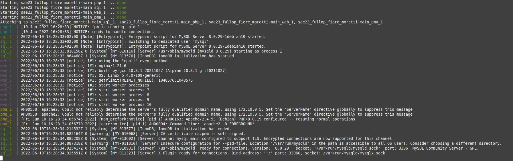</p>

### Si aucun contenaire est marqué comme 'exited', bravo! Vous venez d'installer le service ***Multicast***.
<br>

### **Disclaimer:** pour le bon fonctionnement du service, veuillez ne pas terminer le processus que vous venez de lancer. Si besoin, lancez les conteneurs en arrière plan avec la commande : 
```
sudo docker-compose up -d
```

<br>

-----

<br>

## <u>Utilisation du service :</u>

<br>

### Finalement, après avoir suivi les étapes d'installation, vous pouvez enfin commencer à utiliser le service. <br>

### Sur le port 8080, se trouve le serveur Web de Multicast, qui permet de mettre en place tout ce qui est location de serveur et ainsi de suite.<br>

    lien en local : localhost:8080

Aperçu : 

<p style="text-align:center;">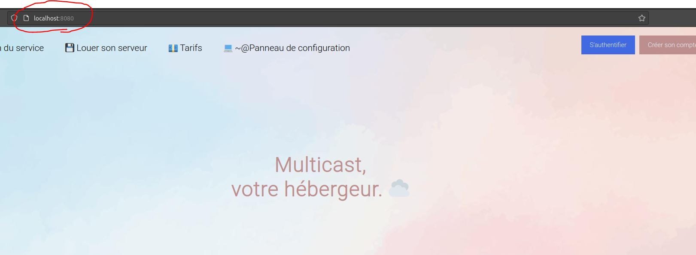</p>

<br>

### Pour ce qui est de la gestion de la base de données, la page PhpMyAdmin se trouve sur le port 8081.

    lien en local : localhost:8081

Aperçu : 

<p style="text-align:center;">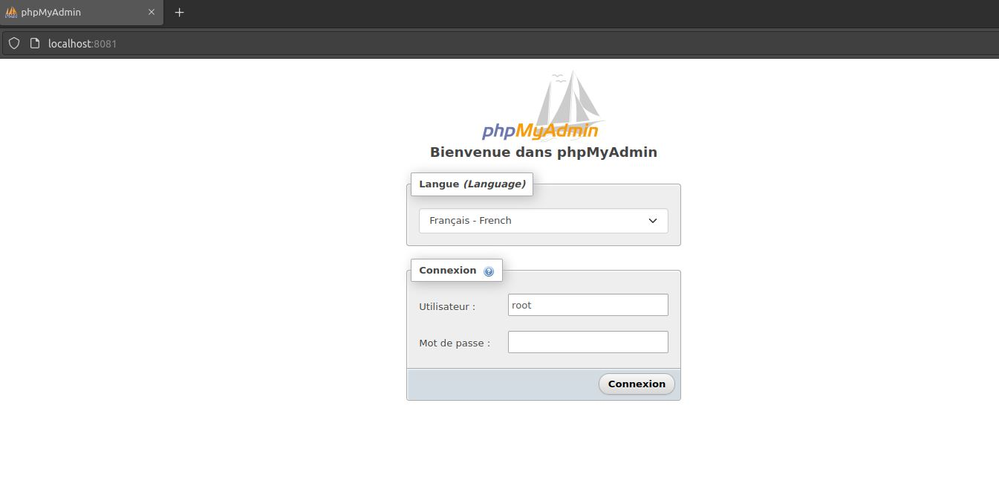</p>

### Pour ce qui est de la connexion au pannel PhpMyAdmin, les identifiants sont **root:root**
### **C'est pour cette raison qu'on vous conseille fortement de modifier le mot de passe ainsi que le nom d'administrateur pour des raisons de sécurité évidentes.**

-----

## <u>Mise en place de la base de données :</u> 

<br>

### Pour ce qui est des données des serveurs, des utilisateurs, vous avez le choix de partir à zéro (zéro utilisateurs enregistrés, zéro serveurs) ou bien alors vous avez le choix d'essayer le service avec des données aléatoires pour prendre en main le site internet.

<br>

### Tout cela se gère dans le dossier intitulé ***'sqlserv'***.

<br>

### <u> Dans ce dossier, vous trouverez trois fichiers : </u>

<br>

* ### Un DockerFile qu'on vous demandera de ne pas toucher et qui sert à l'installation lors du Docker-compose
  <br>

* ### Un script python nommé 'FillDb' qui vous servira à générer des requêtes SQL pour remplir vos tables de façon aléatoire. Pour l'utiliser, vous n'avez qu'à le lancer et copier les requêtes générées.

<br>

* ### Finalement se trouve le fichier le plus important, la base de données SQL que nous allons importer dans le service PhpMyAdmin. De base, il est rempli avec certaines valeurs tests, mais que vous pouvez supprimer en éditant le fichier (En supprimant toutes les lignes à partir de la ligne 49 -> Soit celles commençant par INSERT INTO).

<br>

-----

<br>

## <u>Importation de la base de données :</u>

<br>

### Après avoir modifié vos fichiers comme vous le souhaitez, il faut enfin importer la base de données dans votre pannel admin.

<br>

### Pour cela, c'est très simple : 

<br>

* ### Première étape : Connectez-vous à votre service PhpMyAdmin (lien : localhost:8081) avec les identifiants admin (root:root par défaut)
  <br>

* ### Redirigez-vous dans l'onglet ***'Importation'*** :
<br>
 <p style="text-align:center;">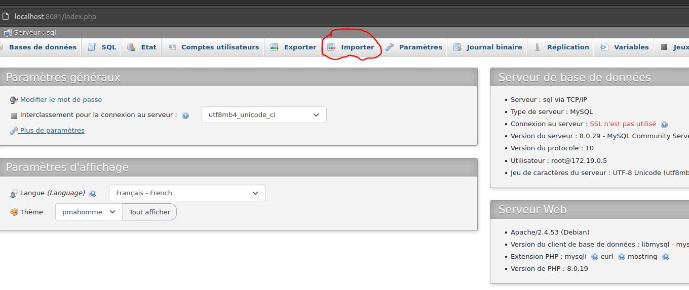</p>
   
<br>

* ### Puis dans 'Fichier à importer' vous cliquez sur **'Parcourir...'**

<br>
 <p style="text-align:center;">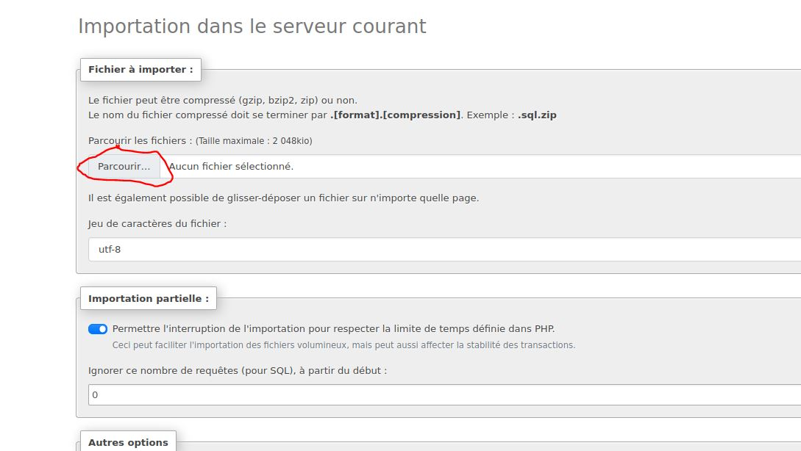</p>
   
<br>

* ### Choisissez ensuite le fichier **db.sql** :

<br>
 <p style="text-align:center;">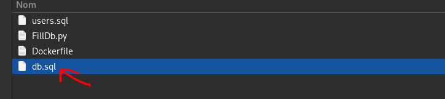</p>
   
<br>

* ### Une fois fait, descendez-en bas de la page et chercher le bouton ***'Importer'*** :

<br>

 <p style="text-align:center;">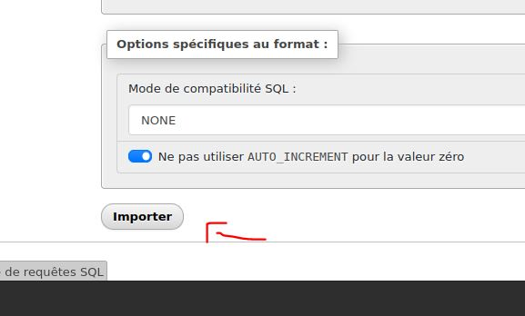</p>
   
<br>

* ### Maintenant suivez les mêmes étapes pour le fichier users.sql:

<br>
 <p style="text-align:center;">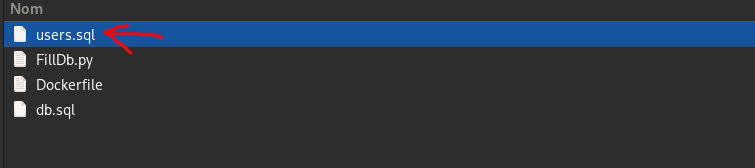</p>

<br>

* ### Vous avez terminé !

<br>
 <p style="text-align:center;">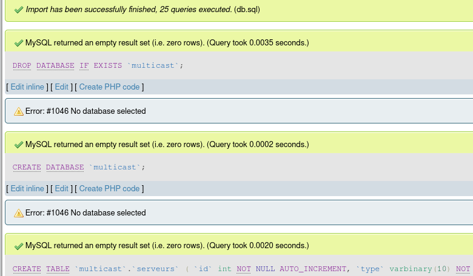</p>
   
<br>

-----

<br>

## <u>Utilisation du service :</u> 

<br>

### Il vous suffit maintenant seulement de vous rendre sur la page web à l'adresse suivante en local (localhost:8080) :

<br>
 <p style="text-align:center;">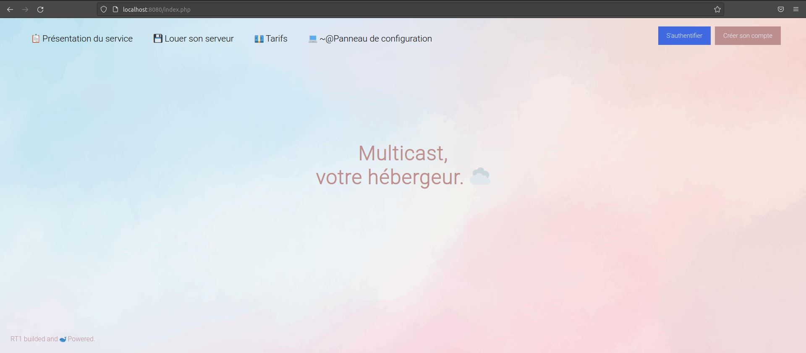</p>
   
<br>

### Vous pouvez à présent faire tout ce que vous voulez sur le site !

<br>

### En vous connectant comme Admin (identifiants -> admin:admin) dans la page de connexion, vous aurez accès un espace dédié à l'administration (Supprimer des serveurs, en rajouter, terminer des locations, etc...).
<br>

### Il vous suffira de cliquer sur le bouton ***'Administration'*** qui est apparu en haut à droite de votre écran : 

<br>
 <p style="text-align:center;">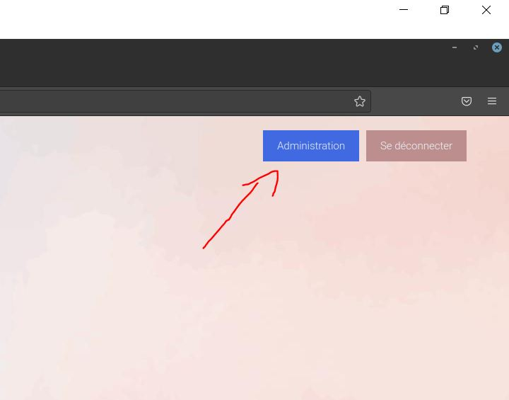</p>
   
<br>

### Aperçu de la page : 

<br>
 <p style="text-align:center;">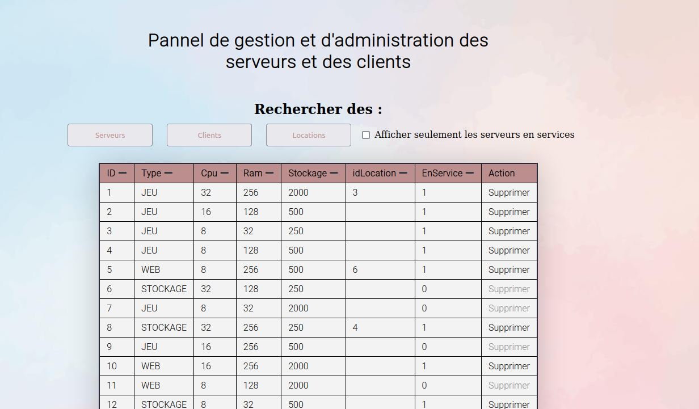</p>

-----

<br>

## <u>Installation bare-metal</u> 

<br>

### Si vous souhaitez installer vos services un a un sur un serveur voici les étapes à suivre.

<br>

### Installation d'Apache2 :

<br>

* ### Grâce à votre gestionaire de paquet installez Apache2 :

<br>
----

## Astuces et crédits : 
<br>

### Pour en savoir un peu plus sur les fonctionnalités du site, vous pouvez vous référez au 'cahier-des-charges' fourni.

<br>

#### ***☁️ Projet Multicast ~ Elouan FIORRE, Timothée FULOP, Luigi MORETTI ☁️***

